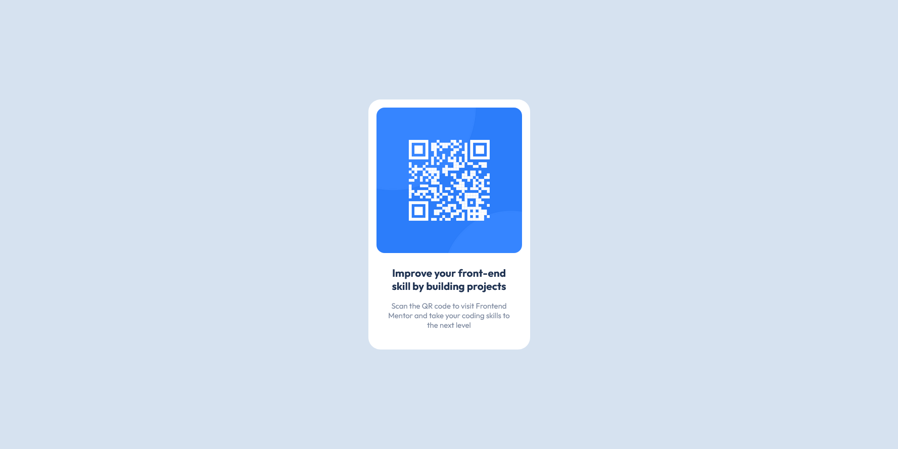

# Frontend Mentor - QR code component solution

This is a solution to the [QR code component challenge on Frontend Mentor](https://www.frontendmentor.io/challenges/qr-code-component-iux_sIO_H). Frontend Mentor challenges help you improve your coding skills by building realistic projects.

## Table of contents

- [Overview](#overview)
  - [Screenshot](#screenshot)
  - [Links](#links)
- [My process](#my-process)
  - [Built with](#built-with)
  - [What I learned](#what-i-learned)
  - [Continued development](#continued-development)
  - [Useful resources](#useful-resources)
- [Author](#author)
- [Acknowledgments](#acknowledgments)

## Overview

### Screenshot



### Links

https://qr-code-component-main-pr.netlify.app/

## My process

First I set up my custom properties in my :root
(These are containing all used colors, the used - and possible font-sizes).

Next I set up the used font and added it to my custom properties.

In my HTML I then created all necessary blocks and a logical name convention for the classes.

When styling everything in CSS I focussed on creating all styles and custom properties to create a component which is very reusable and easy to edit.

### Built with

- Semantic HTML5 markup
- CSS custom properties
- Flexbox
- CSS Grid
- Vite

### What I learned

In HTML I used a h2 element for the only existing headline because I created this with the purpose of a component in mind. So this headline would never be the 'Top-Headline' of a page.

```html
<h2>Improve your front-end skill by building projects</h2>
```

I created custom properties which were used just in this class just to make the component easier to modify

```css
.qr-code {
  --component-width: 20em;
  --box-shadow: 0 5px 5px hsl(0 0% 0% / 0.05);
  --padding: 1em;
  --border-radius: 1.5em;

  max-width: var(--component-width);
  padding: var(--padding);

  text-align: center;

  background-color: hsl(var(--hsl-clr-neutral));
  border-radius: var(--border-radius);
  box-shadow: var(--box-shadow);
}
```

### Continued development

I future projects I want to further improve the use of custom properties and utility classes to make my code better

### Useful resources

## Author

- Frontend Mentor - [@gnss85](https://www.frontendmentor.io/profile/gnss85)

## Acknowledgments

Thanks to Kevin Powell I learned a lot before starting this.
